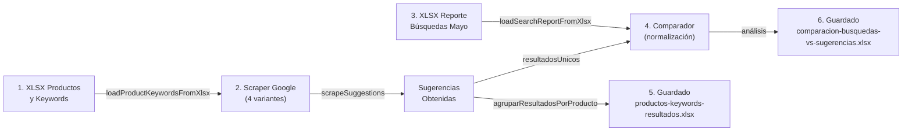

# Scraping Keywords - Estado del Proyecto v2.0

## 📊 Resumen Ejecutivo

El proyecto **Scraping Keywords** está **completamente funcional y optimizado** con módulos de comparación de búsquedas. Genera reportes comparativos entre:
- **Búsquedas reales** del e-commerce (reporte de mayo)
- **Sugerencias de Google** obtenidas por scraping

---

## ✅ Funcionalidades Implementadas

### 1️⃣ **Scraping de Sugerencias de Google**
- ✅ Carga productos y keywords desde XLSX
- ✅ 4 variantes de búsqueda por keyword:
  - `directo` - búsqueda simple
  - `directo_click` - con clic en posición 0
  - `wildcard_inicio` - `*keyword`
  - `wildcard_extremos` - `*keyword*` con clic en posición 1
- ✅ Captura sugerencias del autocomplete
- ✅ Normalización inteligente de texto (acentos, espacios, números)

### 2️⃣ **Comparación Búsquedas vs Sugerencias**
- ✅ Carga reporte de búsquedas reales (mayo)
- ✅ Compara con sugerencias obtenidas
- ✅ Identifica 3 categorías:
  - **Coincidencias** - Búsquedas reales presentes en sugerencias
  - **Ausencias** - Búsquedas reales NO presentes
  - **Oportunidades** - Sugerencias no buscadas

### 3️⃣ **Guardado en XLSX**
- ✅ Resultados de sugerencias por producto
- ✅ Análisis comparativo multi-hoja:
  - Resumen (estadísticas)
  - Coincidencias
  - Búsquedas sin sugerencia
  - Oportunidades

---

## 📁 Estructura del Proyecto

```
Scraping Keywords/
├── app/
│   ├── scraper/
│   │   └── googleScraper.js          ← Scraper principal con clic real
│   ├── keywords/
│   │   └── saveKeywords.js           ← Guardado JSON individual
│   ├── inputs/
│   │   ├── loadProductKeywordsFromXlsx.js
│   │   └── loadSearchReportFromXlsx.js
│   ├── outputs/
│   │   ├── saveResultsToXlsx.js      ← Salida sugerencias
│   │   └── saveComparisonToXlsx.js   ← Salida comparación
│   └── compare/
│       └── compareSearchReportWithSuggestions.js
│
├── scripts/
│   └── index.js                      ← Flujo principal (ES6)
│
├── data/
│   ├── Productos-keywords-relacionadas-1.xlsx
│   └── reporte-busquedas-mayo.xlsx
│
├── output/                           ← Archivos generados
│
└── package.json
```

---

## 🔄 Flujo de Ejecución



---

## 📋 Archivos Generados Recientemente

| Archivo | Fecha | Descripción |
|---------|-------|-------------|
| `productos-keywords-resultados-2026-06-05_13-50-43.xlsx` | 2026-06-05 | Sugerencias por producto |
| `comparacion-busquedas-vs-sugerencias-2026-06-05_13-50-43.xlsx` | 2026-06-05 | Análisis comparativo |

---

## 🎯 Características Clave de la Comparación

### **Normalización de Texto Inteligente**

Convierte variaciones en un estándar comparable:
```
"FMM-101" → "fmm 101"
"módulo FMM-101" → "modulo fmm 101"
"FMM_101/notifier" → "fmm 101 notifier"
```

### **3 Tipos de Análisis**

1. **Coincidencias** - Búsquedas internas presentes en sugerencias Google
2. **Ausencias** - Búsquedas internas NO capturadas por Google
3. **Oportunidades** - Sugerencias Google no buscadas internamente (nuevas palabras clave)

### **Consolidación por Producto**

Agrupa resultados por categoría de producto para análisis granular.

---

## 🚀 Cómo Ejecutar

```bash
cd "C:\Users\Saul\Documents\Proyectos\Scraping Keywords"

# Instalar dependencias
npm install

# Ejecutar flujo completo
node scripts/index.js
```

**Duración estimada:** Depende de cantidad de productos y keywords (puede tomar horas)

---

## 📊 Interpretación de Resultados

### Archivo: `productos-keywords-resultados-*.xlsx`

**Hojas:**
- `Producto` - Resumen por categoría con keywords sugeridas
- `Detalles` - Listado completo de sugerencias

### Archivo: `comparacion-busquedas-vs-sugerencias-*.xlsx`

**Hojas:**

1. **Resumen**
   - Total de coincidencias exactas
   - Búsquedas sin sugerencia
   - Oportunidades identificadas

2. **Coincidencias**
   - Búsqueda interna → Keyword sugerida
   - Tipo: "Coincidencia exacta" o "Coincidencia parcial"
   - Producto donde apareció

3. **Búsquedas sin sugerencia**
   - Búsquedas reales NO presentes en sugerencias
   - Cantidad de búsquedas (tráfico potencial)
   - **Acción:** Optimizar SEO para estas palabras

4. **Oportunidades**
   - Sugerencias de Google no buscadas internamente
   - Producto donde apareció
   - **Acción:** Considerar contenido para capturar tráfico

---

## 🔧 Tecnologías Utilizadas

- **Playwright** - Web scraping y automatización
- **XLSX** - Lectura/escritura de Excel
- **Node.js** - Runtime
- **ES6 Modules** - Sistema de módulos

---

## 📈 Próximos Pasos Sugeridos

1. ✅ Analizar **Ausencias** → Oportunidades de SEO
2. ✅ Estudiar **Oportunidades** → Nuevas palabras clave
3. ✅ Cruzar con **Google Search Console** para volumen real
4. ✅ Implementar estrategia de contenido basada en análisis

---

## ⚠️ Consideraciones

- Google puede mostrar diferentes sugerencias según IP/ubicación
- El clic en posición específica afecta significativamente las sugerencias
- Normalización de texto es crucial para comparaciones precisas
- Derechos de uso: Respetar ToS de Google

---

## 📝 Historial de Versiones

| Versión | Cambio Principal |
|---------|------------------|
| v1.0.0 | Scraper básico de sugerencias |
| v1.0.1 | Agregado repositionamiento de cursor |
| v1.0.2 | Clic real en posición del cursor |
| v1.0.3 | Sistema de clic con calculatePosition |
| v1.0.4 | Integración con Excel de entrada |
| v2.0.0 | **Módulo de comparación con reporte de búsquedas** ✅ |

---

**Estado:** ✅ **PRODUCCIÓN - COMPLETAMENTE FUNCIONAL**
